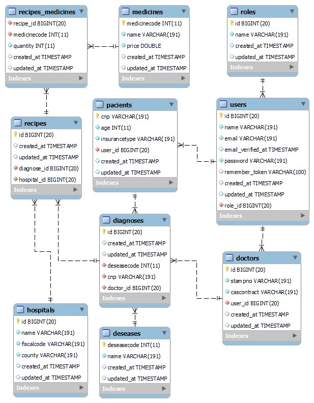

e-Reteta
========

Aplicatia realizeaza managementul clinicilor, medicilor, retetelor si pacientilor.

In cadrul acestei aplicatii exista 3 tipuri de utilizatori:
* Administratorul
* Medicul
* Pacientul

Utilizatorii trebuie sa se autentifice cu user si parola pentru a putea realiza operatii in cadrul acestei aplicatii. 
Medicii sunt introdusi in sistem de catre Administrator, in schimb, Pacientii se pot inregistra siguri, utilizand un formular de inregistrare, sau pot fi introdusi de catre Administrator. 

Pentru realizarea aplicatiei, am utilizat urmatoarele:
* MySQL Server
* Apache HTTP Server
* PHP 
* Framework-ul Laravel 8
* HTML
* CSS
* Bootstrap

Schema Bazei de Date
--------------------
In figura urmatoare este prezentata schema bazei de date:


Tabele utilizate in cadrul aplicatiei sunt urmatoarele:

* `Users`     - retine detaliile de autentificare ale utilizatorilor din sistem
* `Roles`     - retine rolurile pe care le pot avea utilizatorii (_Administrator_, _Doctor_, _Pacient_)
* `Doctors`   - retine detaliile specifice medicilor (cod parafa si contract CAS)
* `Pacients`   - retine detaliile specifice pacientilor (CNP, varsta si tip asigurare)
* `Hospitals` - retine numele clinicii, codul fiscal si judetul
* `Medicines` - retine detalii despre medicamentele introduse (denumire, cod medicament, pret)
* `Deseaseas` - retine numele bolilor si codurile acestora
* `Diagnoses` - retine diagnosticele create de catre medici (cod boala, CNP, id medic), folosite apoi in crearea retetelor
* `Recipes`   - retine detaliile retetelor emise de medic
* `Recipes-Medicines` - tabela de legatura dintre retete si medicamente (tratamentul prescris intr-o reteta - cod medicament si cantitati)

In diagrama se observa cheile primare si chelile straine pentru fiecare tabela.

Conectarea la serverul de baze de date Oracle este definita in fisierul `.env` din radacina aplicatiei:
``` ini
DB_CONNECTION=mysql
DB_HOST=127.0.0.1
DB_PORT=3306
DB_DATABASE=e-reteta
DB_USERNAME=root
DB_PASSWORD=
```
Instalare
---------
Pentru a instala aplicatia in XAMPP se vor realiza urmatorii pasi:
1) Configuram un virtual host care sa pointeze catre folderul `e-reteta/public`.
   In acest sens editam fisierul  `xampp\apache\conf\extra\httpd-vhosts.conf` si adaugam:
   ```apacheconf
    <VirtualHost *:80>
        ServerAdmin webmaster@localhost
        DocumentRoot "C:/Student/xampp/htdocs"
        ServerName localhost   
    </VirtualHost>
    
    <VirtualHost *:80>
        ServerAdmin webmaster@e-reteta
        DocumentRoot "C:/Student/xampp/htdocs/vhosts/e-reteta/public"
        ServerName e-reteta
        ServerAlias www.e-reteta
        ErrorLog "logs/e-reteta-error.log"
        CustomLog "logs/e-reteta-access.log" common
    </VirtualHost>
   ```
2) Instalarea dependentelor cu ajutorul comenzii:
    ``` sh
    cd "C:\Student\xampp\htdocs\vhosts\e-reteta
    composer install 
    ```
3) Crearea bazei de date cu ajutorul comenzii:
    ``` sh
    php artisan migrate
    ```
4) Popularea bazei de date cu ajutorul comenzii:
    ``` sh
    php artisan db:seed
    ```
sau
5) Crearea bazei de date si popularea ei cu ajutorul comenzii:
    ``` sh
    php artisan migrate:refresh --seed
    ```

Daca se populeaza baza de date vor fi creati urmatorii useri:
* `admin@admin.com` cu parola `secret` - Cont de tip Administrator
* `doctor1@clinica.com` cu parola `secret` - Cont de tip Doctor
* `pacient1@yahoo.com` cu parola `secret` - Cont de tip Pacient


Diagrama de Clase
-----------------
In figura urmatoare sunt prezentate principalele pachete ale aplicatiei sub forma de diagrame UML:


  
Descrierea Aplicatiei
---------------------

Aplicatia este accesibila in browser, la adresa http://www.e-reteta. 
Pentru a accesa functionalitatile, utilizatorul trebuie sa se autentifice: 


### Administratorul 

Se autentifica utilizand urmatoarele credentiale: `admin@admin.com`/`secret` si poate realiza urmatoarele operatii:
 *  gestiunea clinicilor, 
 *  gestiunea medicilor, 
 *  gestiunea pacientilor, 
 *  gestiunea medicamentelor, 
 *  generarea de rapoarte.  

#### Gestiunea clinicilor

##### Lista clinicilor
In imaginea urmatoare este prezentata lista clinicilor:


Administratorul poate adauga clinici noi, le poate edita si le poate sterge.

##### Editarea unei clinici

In imaginea urmatoare este prezentata editarea unei clinici:


##### Stergerea unei clinici

In imaginea urmatoare este prezentata stergerea unei clinici:


#### Gestiunea medicilor

##### Lista medicilor
In imaginea urmatoare este prezentata lista medicilor:


##### Adaugarea unui medic
Atat medicii cat si pacientii sunt in primul rand inregistrati ca User (cu nume, email, parola si rol), apoi in tabelele proprii au campuri separate care ii identifica (Medici: Cod Stampila si Contract CAS)


##### Editarea unui medic

In imaginea urmatoare este prezentata editarea medicilor:


#### Gestiunea medicamentelor

##### Lista medicamentelor

In imaginea urmatoare este prezentata lista medicamentelor:


##### Editarea unui medicament

In imaginea urmatoare este prezentata editarea medicamentelor:


#### Gestiunea pacientilor

Pacientii sunt in primul rand inregistrati ca User (cu nume, email, parola si rol), apoi in tabelul propriu au campuri separate care ii identifica (Pacienti: CNP, Varsta, Tip  asigurare )

##### Lista pacientilor

In imaginea urmatoare este prezentata lista pacientilor:


##### Adaugarea unui pacient

In imaginea urmatoare este prezentata adaugarea unui pacient:


##### Editarea unui pacient

In imaginea urmatoare este prezentata editarea pacientilor:


#### Rapoarte:

##### 1. Raportul medicamentelor prescrise de fiecare medic

In imaginea urmatoare este prezentat acest raport, care contine cantitatea din fiecare tip de medicament prescris, precum si valoarea medicamentelor (cantitate * pret unitar).


##### 2. Raport cu cantitatile totale de medicamente prescrise 

In imaginea urmatoare este prezentat acest raport, care contine cantitatile totale din fiecare tip de medicament prescrise de toti medicii, in toate clinicile considerate.


##### 3. Raport cu numarul de retete emise fiecarui pacient

In imaginea urmatoare este prezentat acest raport, care contine numarul total de retete prescrise fiecarui pacient de toti medicii, in toate clinicile considerate.


#### Gestiunea retetelor de catre fiecare medic

Fiecare medic din sistem poate gestiona diagnosticele emise si retetele aferente, avand drepturi doar asupra proprilor retete. 

Un  medic poate profesa in cadrul mai multor clinici.
Fiecare reteta emisa poate contine mai multe coduri de medicamene, in diferite cantitati, ajustabile.

##### Lista retetelor 

In imaginea urmatoare este prezentata pagina retetelor. Se observa ca atunci cand Doctor1 este logat, poate vedea doar retetele emise sub codul propriu. 
Odata emisa o reteta, nimeni nu mai are dreptul de editare sau stergere din sistem, medicul avand doar drept doar de citire. 


##### Adaugarea unei retete

La adaugarea unei retete, medicul vede doar pacientii introdusi in sistem in urma unei programari, altfel trebuie sa ii inregistreze si poate selecta clinica la care face consultatia, codul bolii si unul sau mai multe medicamente (pentru fiecare se realizeza un Select).


#### Retetele unui pacient

Fiecare pacient, in urma logarii isi poate vedea retetele care i-au fost emise, dar nu are alt drept asupra lor.

